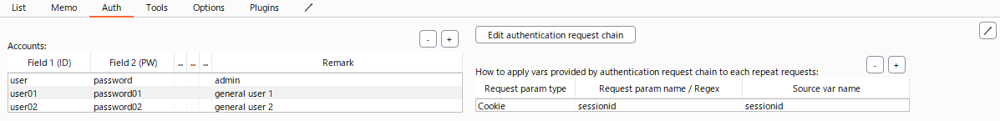
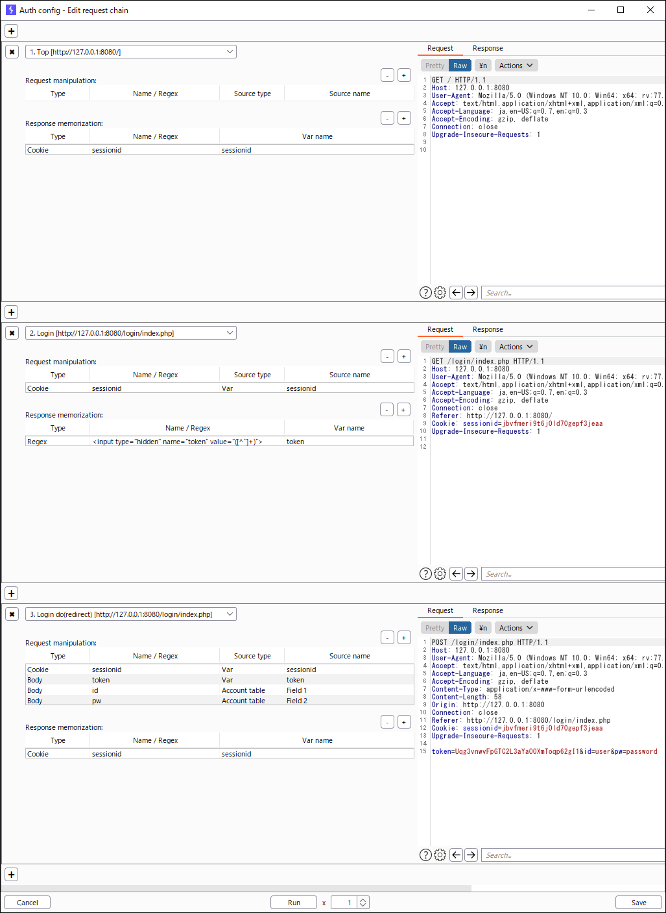
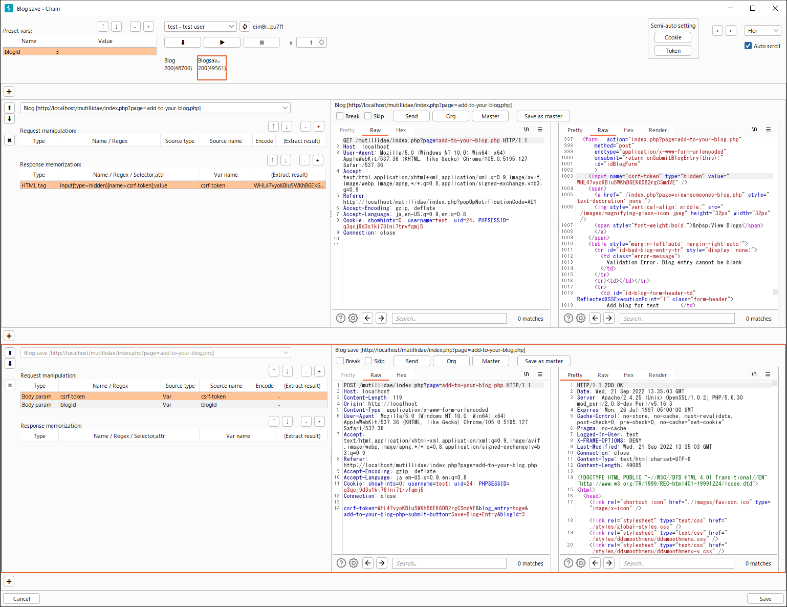

English / [Japanese](README.ja.md)

# ISTE: Integrated Security Testing Environment

ISTE is a Burp extension that provides total support for security testing of web applications.  
ISTE puts you in a flow state.


\* I used [OWASP Mutillidae II](https://github.com/webpwnized/mutillidae) in my demonstration.

## Features

### Basic Features

| Feature　　　　　 | Explanation | Remark |
| :-- | :-- | :-- |
| URL list | A feature to manage URLs to be tested in a project. It also provides features such as editing names and remarks, sorting and filtering, copying to clipboard in TSV or template format, and various Send-To menus. | Since URLs and raw logs are linked and saved in the DB (SQLite), there is no need to map the URL list and raw logs, which occurs when creating a URL list in a spreadsheet, etc. |
| Notes | Notes for each project, each URL, and each repeat. You can also set up note templates. | You can write notes while viewing the raw log, and they will be linked to the raw log and saved in the DB. The notes are saved when they are focused out. |
| Progress management | Provides a column to enter the progress in the URL list. Automatic coloring and filtering based on progress is possible. | No more time consuming double maintenance and formatting of the URL list and progress list. Filtering operations are light. |
| Repeat history | For each URL in the URL list, it provides a feature of issuing repeat request and managing history. | Eliminate frustration about repeater history. |
| Master for repeat | For each URL in the URL list, this feature defines a base request (Master) for repeat, which can be used as the base for request editing. | It is useful to save the request that you want to use as a base when repeatedly testing while changing the payload. |

### Advanced Features

| Feature　　　　　 | Explanation | Remark |
| :-- | :-- | :-- |
| **Repeat as a specific account** | A feature to issue repeat request as a specific account of the target system. It also provides a button to refresh the session. | Powerful support for testing of broken access control! |
| Account management | A feature to manages the accounts of the target system. | Registered accounts can be used in "Repeat as a specific account". |
| Authentication settings | A feature to define the authentication flow of the target system and how to apply values provided by authentication flow to each repeat requests. | The entity of the authentication flow is the request chain described below. Cases that require manual input, e.g., SMS authentication, can also be handled by setting breakpoints. |
| **Request chain** | For each URL in the URL list, the feature to define a request chain, i.e., a sequence of multiple requests and parameter transfer, and issue it repeatedly. Flexible execution control, including series of executions, step executions, breakpoints, and re-issue of single nodes. | Automates the work of maintaining the consistency of the issue order and transferring parameters, which usually requires care when repeating! |

[Account management & Authentication settings]


[Request chain]


### Experimental Features

| Feature　　　　　 | Explanation | Remark |
| :-- | :-- | :-- |
| Export notes | A feature to export notes in a simple Markdown format. | I haven't been able to take a lot of things into account, but it's the least I can do when I want to share my notes with others. Also, since the search function of the notes is not implemented yet, you can use it to export and search with a text editor. |

### Exploit Features

CAUTION: Please note that this group of features must not be executed without the permission of the administrator of the target system.

| Feature　　　　　 | Explanation | Remark |
| :-- | :-- | :-- |
| Blind SQL Injection | A feature that automates the process of retrieving data using a detected Blind SQL Injection vulnerability. The purpose of this feature is to make it clear to the administrator of the target system that the vulnerability is available. | This is a feature for experts, with priority given to versatility. This feature performs a binary search using ASCII codes as the search range. |

[Blind SQL Injection]


### ISTE Extender API

| Feature　　　　　 | Explanation | Remark |
| :-- | :-- | :-- |
| Plugin | Provides an extension point for ISTE. | The features of ISTE will basically be implemented in ISTE itself, but extremely personal features, such as the ability to link with self-made applications, will be implemented as plug-ins. see: [ISTE Plugin API](https://github.com/okuken/iste-plugin-api) and [ISTE Plugin Sample](https://github.com/okuken/iste-plugin-sample) |

## Prerequisites

[Burp Suite Community Edition](https://portswigger.net/burp/communitydownload) or [Burp Suite Professional](https://portswigger.net/burp/pro)

## Installing ISTE

1. Download the iste-x.x.x.jar file of the latest release from [Releases](https://github.com/okuken/integrated-security-testing-environment/releases).
1. Launch Burp Suite and click the Add button under Extender > Extensions.
1. Enter the information as follows and click the Next button.
   * Extension type: Java
   * Extension file (.jar): Select the jar file you downloaded above.

## Getting Started

### At ISTE Startup
1. Set the path to the DB file (SQLite3(.db)) *First time only
   * To change: ISTE > Options > User options > Misc
1. Select the ISTE project
   * If this is the first time or you are starting a new security testing project, select "** Create new project **" to create a new ISTE project.
   * If you are using Burp Suite Professional, it is recommended to set the ISTE project name as the same as the Burp project name, so that the ISTE project will be automatically selected next time.
   * To change: ISTE > List, click the "..." button next to the project name

### Basic Flow
1. Write notes about basic information of the security testing project.
   * Write notes in ISTE > Notes. It is a notes for each ISTE project.
   * Template setting: ISTE > Options > User options > Note templates > Notes
1. Creating a list of target URLs to be security tested
   * Crawl the target system with Burp Suite as a proxy
   * Select the URLs to be tested on Proxy > HTTP history, and add the URLs to ISTE > List by clicking "Send to ISTE" in the context menu.
   * The Name column in ISTE > List is populated with the content of Comment in Proxy > HTTP history by default, so edit it if necessary. Fill in Remark columns, etc. as needed.
1. Perform security testing
   * Select the URL to be tested in ISTE > List, and take notes in the Notes field on the right side of the screen while performing the security testing.
   * Template setting:  ISTE > Options > User options > Note templates > List
   * Change the value of the progress column of the URL that has completed testing to Done.
   * If necessary, use the progress filter at the top of the screen to check the number of remaining items and proceed with the testing.

### Advanced Usage

#### Using Repeater
* Select the URL to be repeated in ISTE > List, edit the request in the Repeat tab at the bottom of the screen, and issue it with the Send button.
* The repeat history table will be displayed upper half of the tab, so proceed with the testing while taking notes in the Notes column as appropriate.
* If you want to return the message editor to the original request, click the Org button.
* If you have a request that you want to use as a base for testing in addition to the original request, save it using the "Save as master" button. The saved request can be set to message editor using the Master button.
* The INSPECTOR feature, added in Burp Suite 2020.11, is not yet supported. I would like to support it when it is added to the Burp Extender API.

#### Using Repeater as a specific account
1. Configure the settings in ISTE > Auth
   * Register accounts in the Accounts table
      * Basically, enter the user ID in Field 1 and the password in Field 2.
   * Define the authentication flow
      1. Click the "Edit authentication request chain" button to open the request chain window.
         * Alternatively, it is recommended to select the requests required for the authentication flow in the URL list table in ISTE > List and press "Create auth chain" in the context menu to open the request chain window with the requests already added.
      1. Add the necessary requests to the authentication flow and set up parameter transfer as needed.
         * [Experimental] Cookie transfer settings can be made semi-automatically by clicking the Cookie button in the Semi-auto setting column at the top of the screen. Tokens and other information which are included as hidden and meta tag can be transferred by clicking the Token button.
      1. For requests with user ID and password as parameters, add the settings to the "Request manipulation" table, specifying the "Account table" in the "Source type" column and the field number in the "Source name", e.g. 1 for user ID, 2 for password, etc.
         * If necessary, specify URL-encode in the Encode column.
      1. For requests that require manual value entry ,e.g. SMS authentication, check the Breakpoint checkbox ON.
      1. If you want to check the behavior, select an account in the Account combo box at the top of the screen and click the start button (▶). Be aware that requests will be issued to the target system.
      1. Set the session ID and other values obtained as a result of the authentication to the "Response memorization" table.
      1. When you have finished setting the flow, click the Save button and close the window.
   * Define how to apply values provided by authentication request chain to each repeat requests
      * Register the applicable destination in table "How to apply vars provided by authentication request chain to each repeat requests".  
        For example, in the case of a system that uses the cookie "sessionid" as the session ID for session management:
         * Request param type: Cookie
         * Request param name: sessionid
         * Source var name: Var name registered in the "Response memorization" table in the authentication flow
1. Issue repeat request as a specific account
   * Select the URL to be repeated in ISTE > List, open the Repeat tab at the bottom of the screen, select an account in the Account combo box, and click the Send button.
   * If you want to refresh the session, click the Refresh button next to the Account combo box.
   * If you want to refresh the session and repeat it, hold down the Shift key and click the Send button.

#### Using Request chain
1. In ISTE > List, create a request chain using the following procedure
   1. Select the requests to be included in the request chain and press "Create chain" in the context menu. A dialog box for selecting the main request, which is the main request to be diagnosed in the request chain, is displayed, and when you select it, the new request chain window is displayed.
      * The request chain is stored referred by the main request.
      * Only one request chain can be saved with a certain request as the main request. If a request for which a request chain has already been saved is selected as the main request, a warning dialog box will be displayed asking whether it can be overwritten or not.
   1. Configure parameter transfer settings as needed
      * [Experimental] Cookie transfer settings can be made semi-automatically by clicking the Cookie button in the Semi-auto setting column at the top of the screen. Tokens and other information which are included as hidden and meta tag can be transferred by clicking the Token button.
      * If you want to apply preset values to the request instead of values included in the response, define them in the "Preset vars" table at the top of the screen.
   1. Press the Save button to save chain.
1. Execute request chain
   1. Open request chain window
      * Double-click on a request with a predefined request chain (with 🔗 in the Chain column) in the URL list, or click "Open chain" in the context menu, or the Chain button in the Repeater tab.
      * You can execute in new chain window described above.
   1. If necessary, edit requests and select an account in the Account combo box at the top of the screen
   1. Execute request chain by click the Start button (▶)
      * Use the Step button (⬇) if you want to proceed with each request while checking results and editing subsequent requests.
      * If you want to pause before executing a specific request, check the Breakpoint checkbox.
      * If you want to skip issue of a specific request, check the Skip checkbox.
      * If you want to issue a specific request multiple times alone, use the Send button of the target request.

## Notes

* It does not support simultaneous access from multiple ISTEs to an ISTE project. It can make the data inconsistent.
* **The author assumes no responsibility for any damage caused by or related to this software.**

## Build ISTE

```
git clone https://github.com/okuken/iste-plugin-api.git
cd iste-plugin-api
gradlew
cd ..

git clone https://github.com/okuken/integrated-security-testing-environment.git
cd integrated-security-testing-environment
gradlew
```
-> build/libs/iste-x.x.x.jar

## License

[GPLv3](LICENSE)
